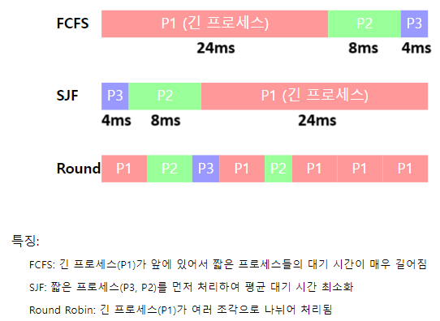

# TIL Template

## 날짜: 22025-02-05

## 딥다이브
### CPU 스케쥴링 알고리즘즘
<aside>
💡

### CPU 스케쥴링이란?

**자원을 어떤 프로세스에 얼마나 할당하는지 정책을 만드는 것**

</aside>

- 응답시간 : 내가 데이터를 입력한 뒤 출력까지 걸리는 시간
- 대기시간 : 프로세스들이 준비 상태로 대기열에서 기다린 시간

---

### CPU 스케줄링 알고리즘 비교

#### FCFS (First-Come, First-Served)

- 특징: 가장 단순한 스케줄링 방식으로, 먼저 도착한 프로세스를 먼저 처리
- 장점: 구현이 간단하고 공평함
- 단점: 긴 프로세스가 앞에 있으면 짧은 프로세스들의 대기 시간이 길어짐 (convoy effect)

> Convoy Effect : 다른 모든 프로세스들이 커다란 한 프로세스가 끝날 때까지 계속 기다리는 현상
> 

#### SJF (Shortest Job First)

- 특징: 실행 시간이 가장 짧은 프로세스를 먼저 처리
- 장점: 평균 대기 시간이 가장 짧음
- 단점: 긴 프로세스는 실행이 계속 미뤄질 수 있음 (starvation)

> Starvation(기아현상) : 작은 실행시간을 가진 프로세스를 먼저 처리하느라 긴 프로세스는 무한정 기다리는 현상
> 

#### Round Robin

- 특징: 각 프로세스에 동일한 시간 할당량(time quantum)을 주고 순환
- 장점: 응답 시간이 빠르고 공평함
- 단점: context switch 오버헤드가 큼

<aside>
💡

> **FCFS의 평균 대기시간**
> 
- P1 : 실행되기까지 0ms 걸렸다. → 대기시간 = 0 [ms]
- P2 : 실행되기까지 24ms 걸렸다. → 대기시간 = 24 [ms]
- P3 : 실행되기까지 32ms 걸렸다. → 대기시간 = 32 [ms]

∴ 평균 대기 시간 = (0 + 24 + 32) / 3 = 18.6 [ms]

---

> **SJF의 평균 대기시간**
> 
- P1 : 실행되기까지 12ms 걸렸다. → 대기시간 = 12 [ms]
- P2 : 실행되기까지 4ms 걸렸다. → 대기시간 = 4 [ms]
- P3 : 실행되기까지 0ms 걸렸다. → 대기시간 = 0 [ms]

∴ 평균 대기 시간 = (12 + 4 + 0) / 3 = 5.3 [ms]

</aside>

---

### 각각의 스케줄링 알고리즘이 응답/대기 시간에 미치는 영향

#### 응답 시간 (Response Time)

- FCFS: 앞선 프로세스들의 실행 시간에 크게 영향받음
- SJF: 짧은 작업들의 응답 시간이 매우 빠름
- Round Robin: 모든 프로세스가 빠르게 첫 응답을 받을 수 있음

#### 대기 시간 (Waiting Time)

- FCFS: convoy effect로 인해 평균 대기 시간이 길어질 수 있음
- SJF: 가장 짧은 평균 대기 시간을 보장
- Round Robin: 시간 할당량에 따라 대기 시간이 달라지며, 일반적으로 중간 정도의 성능

---

### 각 스케줄링 알고리즘에 적합한 상황

#### FCFS (First-Come, First-Served)

- 적합한 환경: 배치 처리 시스템, 대형 데이터 처리, 과학 계산
- 예시:
    - 밤새 실행되는 대용량 로그 파일 분석 작업
    - 기상 데이터 처리와 일기 예보 모델 계산
    - 월말 회계 마감을 위한 대규모 재무 데이터 처리
- 선택 이유:
    - 이러한 작업들은 사용자 상호작용이 필요 없음
    - 작업 시간이 비교적 예측 가능하고 비슷한 크기를 가짐
    - 단순한 순서대로의 처리가 시스템 관리와 모니터링을 용이하게 함
- 주의사항:
    - 긴급한 작업이 있을 경우 별도의 우선순위 큐를 사용해야 함
    - 시스템 자원 사용량을 고려하여 배치 작업 수를 조절해야 함

#### SJF (Shortest Job First)

- 적합한 환경: 웹 서버, 프린트 서버, 컴파일 서버
- 예시:
    - 웹 서버에서 작은 정적 파일 요청 처리
    - 프린트 서버에서 한 페이지짜리 문서 먼저 처리
    - IDE에서 소스 코드 컴파일 작업 관리
- 선택 이유:
    - 대부분의 요청이 작은 크기이므로 전체 처리량 향상
    - 사용자 만족도 증가 (대부분의 사용자가 빠른 응답 받음)
    - 시스템 자원의 효율적 활용 가능
- 실제 구현 전략:
    - 작업 시간 예측을 위해 이전 실행 기록 활용
    - 에이징(aging) 기법으로 긴 작업의 기아 현상 방지
    - 하이브리드 방식으로 긴 작업을 위한 별도 큐 운영

#### Round Robin

- 적합한 환경: 대화형 시스템, 실시간 시스템, 멀티유저 환경
- 예시:
    - 클라우드 기반 개발 환경 (예: AWS Cloud9, GitHub Codespaces)
    - 실시간 게임 서버에서 플레이어 요청 처리
    - 학교 컴퓨터실의 공유 컴퓨터 시스템
- 선택 이유:
    - 모든 사용자에게 공평한 CPU 시간 분배
    - 빠른 응답 시간으로 실시간 상호작용 가능
    - 한 프로세스의 문제가 전체 시스템에 미치는 영향 최소화
- 최적화 전략:
    - 시스템 부하에 따른 동적 타임 퀀텀 조절
        - 부하가 높을 때: 타임 퀀텀을 줄여 응답성 유지
        - 부하가 낮을 때: 타임 퀀텀을 늘려 문맥 교환 오버헤드 감소
    - 프로세스 특성에 따른 다중 큐 운영
        - I/O 중심 프로세스를 위한 짧은 타임 퀀텀 큐
        - CPU 중심 프로세스를 위한 긴 타임 퀀텀 큐

### 오늘의 회고
- 예전에 배웠던 내용을 딥다이브 주제로 접하니 기억을 되새길 수 있는 시간이었다.

### 참고 자료 및 링크
- [CPU 스케쥴링 - 윤찬미 블로그그](https://yoon-dumbo.tistory.com/entry/OS-CPU-%EC%8A%A4%EC%BC%80%EC%A5%B4%EB%9F%AC)
