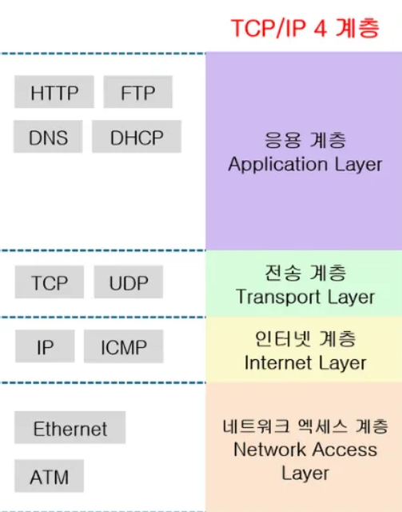
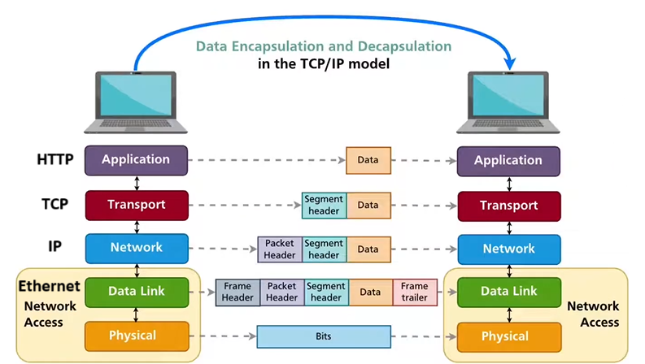
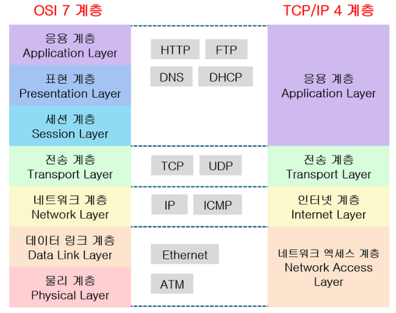

# TIL Template

## 날짜: 2025-02-12

## TCP/IP 계층 모델

1. **응용 계층 (Application Layer)**
    - 사용자와 가장 가까운 계층
    - 주요 프로토콜: HTTP, FTP, SMTP, DNS 등
2. **전송 계층 (Transport Layer)**
    - 데이터의 신뢰성 있는 전송을 담당
    - 주요 프로토콜: TCP, UDP
3. **인터넷 계층 (Internet Layer)**
    - 패킷의 라우팅을 담당
    - 주요 프로토콜: IP, ICMP, ARP
4. **네트워크 접근 계층 (Network Access Layer)**
    - 물리적 네트워크 연결과 데이터 전송을 담당
    - 주요 프로토콜: Ethernet, Wi-Fi

## Encapsulation & Decapsulation

**Encapsulation (캡슐화)**

- 상위 계층에서 하위 계층으로 데이터가 전달될 때 각 계층에서 헤더 정보를 추가하는 과정

**Decapsulation (역캡슐화)**

- 수신 측에서 하위 계층에서 상위 계층으로 데이터가 전달될 때 각 계층의 헤더를 제거하는 과정

- Encapsulation 과정 설명
    
    응용 계층의 HTTP 데이터 → 전송 계층에서 TCP 헤더 추가 → 인터넷 계층에서 IP 헤더 추가 → 네트워크 접근 계층에서 Ethernet 헤더 추가
    
- Decapsulation 과정 설명
    
    Ethernet 프레임 수신 → Ethernet 헤더 제거 → IP 패킷 추출 → IP 헤더 제거 → TCP 세그먼트 추출 → TCP 헤더 제거 → HTTP 데이터 추출
    

---

## OSI 계층모델

### 오늘의 회고
- 예전에 배웠던 TCP/IP 계층모델을 복습 겸 정리해봤다.
- 내일은 nginx 코드를 수정해서 과제 진도를 쭉 빼고싶다...